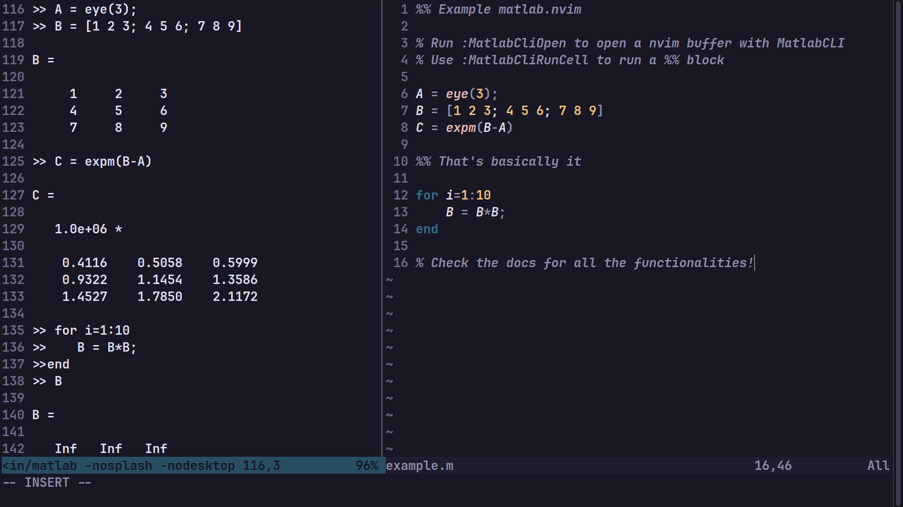

# matlab.nvim

 [](https://opensource.org/licenses/MIT)

**Simple Lua plugin made to run Matlab code from Neovim.**

*Do you find yourself forced to use Matlab by forces that be?*

*Do you weep just thinking about abandoning your hand-tailored, blazing-fast Neovim editor and using Matlabs proprietary, slow, bloated, garbage one?*

*Fear not, [matlab.nvim](https://github.com/MIBismuth/matlab.nvim) was made for you!*




This plugin allows for Matlab integration straight into Neovim! It achieves that by opening an instance of MatlabCLI on a Neovim terminal buffer and piping
commands to it. Several user commands are provided to take advantage of basic
functionalities.

---

## Instalation

You can install matlab.nvim using your favorite plugin manager!

Remember to add the path to your matlab executable on the `setup` method.

Using [lazy.nvim](https://github.com/folke/lazy.nvim)
```lua
{
    "MIBismuth/matlab.nvim",
    config = function()
        require('matlab').setup({
            matlab_dir = "path/to/your/bin/matlab"
        })
}
```
--- 

## Keybindings

The following are the keybindings I like using:

```lua
-- Keymaps
vim.api.nvim_set_keymap('n', '<leader>mo', ':MatlabCliOpen<CR>', {})
vim.api.nvim_set_keymap('n', '<leader>mc', ':MatlabCliCancelOperation<CR>', {})
vim.api.nvim_set_keymap('n', '<leader>mh', ':MatlabHelp<CR>', {})
vim.api.nvim_set_keymap('n', '<leader>md', ':MatlabDoc<CR>', {})
vim.api.nvim_set_keymap('n', '<leader>me', ':MatlabOpenEditor<CR>', {})
vim.api.nvim_set_keymap('v', '<leader>mr', ':<C-u>execute "MatlabCliRunSelection"<CR>', {})
vim.api.nvim_set_keymap('n', '<leader>mw', ':MatlabOpenWorkspace<CR>', {})
vim.api.nvim_set_keymap('n', '<leader><CR>', ':MatlabCliRunCell<CR>', {})
```
---

## Usage

First, run the command `:MatlabCliOpen` to open a new Neovim terminal buffer with an instance of MatlabCLI.

* `:MatlabCliRunCell` - runs the current cell (`%%` blocks), similar to \<Ctrl-Enter\> on Matlab.
* `:MatlabCliRunSelection` - runs the previous visual mode selection.
* `:MatlabCliCancelOperation` - sends SIGINIT to CLI, similar to \<Ctrl-c\> on Matlab.
* `:MatlabHelp` - gets helt on the current word under the cursor.
* `:MatlabDoc` - gets the documentation for the current work under the cursor.
* `:MatlabOpenWorkspace` - opens GUI workspace on a separate window.
* `:MatlabOpenEditor` - opens current buffer on Matlab's GUI editor, for those times you can't escape it.

---

## TODO

* Add toggling functionality to the terminal buffer.
* Improve support for functions.

---
## Related Projects

- [nvim-matlab](https://github.com/Rahlir/nvim-matlab)
